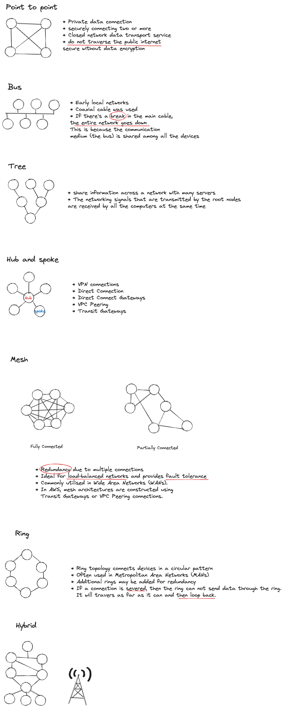
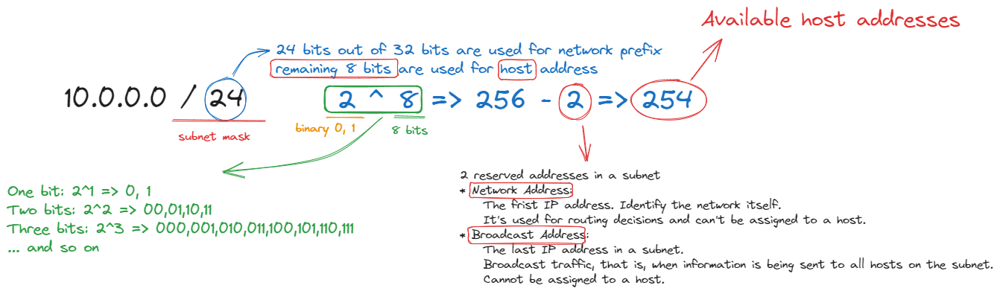
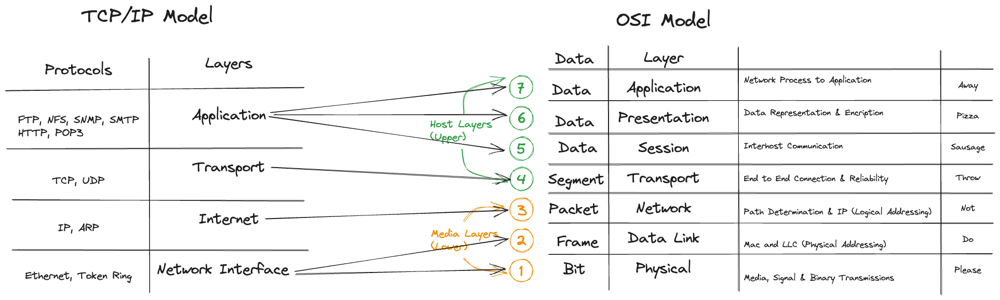

# Network
## Design Pattern
Reference: AWS Skill builder/AWS Networking Basic/Networking Concepts
 

### CIDR (Classless Inter-Domain Routing)
This is a method for allocating IP addresses and routing Internet Protocol packets.

### IPv4 CIDR example

### Network Address
This is the first IP address in a network, where all the host bits are set to 0. It is used to identify the network itself. For example, if your network is defined as 10.0.0.0/16, the network address is 10.0.0.0. This address is used for routing decisions and can't be assigned to a host (like a computer or server).

### Host Address
These are the IP addresses within the network that can be assigned to individual devices (or hosts). For example, in the 10.0.0.0/16 network, the possible host addresses are from `10.0.0.1 to 10.0.255.254`. **Each host within a network must have a unique IP address**.

### Broadcast Address
This is the last IP address in the subnet, where all the host bits are set to 1. This address is used for broadcast traffic, that is, when information is being sent to all hosts on the subnet. Like the network address, this cannot be assigned to a host.

### Private IP Ranges
Private address ranges that are assigned by Internet Assigned Numbers Authority(IANA).
[Private Address Ranges](https://www.ibm.com/docs/en/networkmanager/4.2.0?topic=translation-private-address-ranges)
* 10.0.0.0 to 10.255.255.255 
* 172.16.0.0 to 172.31.255.255 
* 192.168.0.0 to 192.168.255.255 

Private IP addresses are used for local networks and are not routable on the public internet.

If you were to use a public IP address range like `120.0.0.0/16` for your private network, you could potentially encounter IP address conflicts. For example, **if your network needs to communicate with an internet server that has an IP address in the 120.0.0.0/16 range, your network's routing could become confused and the communication might fail.**

Therefore, it is always recommended to use the private IP ranges for your VPC or any private networks to avoid such conflicts and issues.

# Protocols
## OSI Reference Model vs TCP/IP Protocol Framework

